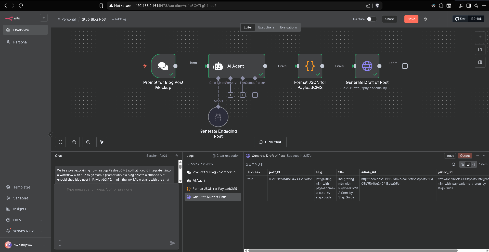
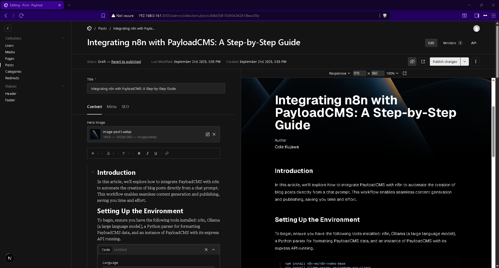
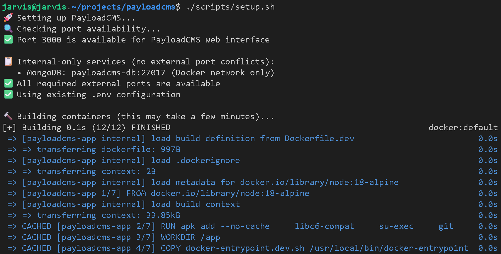

# PayloadCMS with Agentic Content Generation

A Docker-based PayloadCMS v3 application enhanced with an intelligent content generation API designed for n8n workflow automation. This system transforms natural language prompts into structured blog posts using AI-powered content generation.

## Recognition

None of this would have been possible without [PayloadCMS](https://github.com/payloadcms/payload). As far as I've gotten with it, it's the best. I tried Pageflow before this and was not impressed with it's configurability. Payload has proved to be easy to work with and highly configurable.

I tried to do my own frontend and oof, what a mess that was. I'm no front end designer. So I owe an absolutely massive shoutout to [Gioruu](https://github.com/gioruu) and the work he did in this [simple-payload-starter](https://github.com/gioruu/simple-payload-starter). I love the way that project looked and felt right out of the box. The live preview is fantastic. There were some issues with the home page typescript which I patched [here](https://github.com/cskujawa/payloadcms-api/blob/main/data/payloadcms/seedData/home-fixed.ts).

## Overview

This project serves as a complete PayloadCMS solution designed for integration into any Docker Compose stack. It provides a full-stack CMS including backend API, frontend interface, and intelligent content generation capabilities through n8n workflow automation.

**Modular Design**: This system can be easily plugged into existing Docker Compose environments, providing instant CMS capabilities without disrupting your current infrastructure. The internal Docker networking ensures seamless integration with other services in your stack. Just change `proxy-payloadcms-to-your-n8n-network` in the docker-compose file to the docker network with your n8n instance.



**Decent Post Mockups**: I am using llama3.1:8b in the Ollama node in the n8n workflow, so the content generation is intentionally light. This isn't designed to create publish ready posts, this is to alleviate having to manually create every single block in a post when a lot of posts follow very similar structural patterns. Below is a post generated by the n8n workflow, ready to be edited and filled in with actual content/images, and then published.



## Architecture

### Content Generation Workflow

1. **Chat Input** → n8n receives natural language prompt
2. **AI Processing** → n8n Ollama node processes prompt using structured system prompt
3. **JSON Structuring** → Python parser converts AI output to PayloadCMS format
4. **Post Creation** → Express API creates draft post using PayloadCMS blocks
5. **Editorial Review** → Draft posts await manual review and publishing

### Key Components

- **PayloadCMS v3** - Modern headless CMS with block-based content editing
- **Express API Server** - Custom API endpoint for automated content creation (port 3001)
- **n8n Integration** - Workflow automation for AI-driven content generation
- **MongoDB Database** - Persistent data storage with Docker volumes
- **Structured AI Prompts** - Intelligent content formatting and organization

## Quick Start

Look, I aim to make the tech I work with accessible, and I know the burdens of project clutter all to well. That's why I designed this project with scripts for setting up and managing the project. 

### Initial Setup

```bash
# Run the automated setup
./scripts/setup.sh
```



### Monitor Startup Process

Watch the container logs to know when the server is ready:

```bash
# Monitor logs until you see "Ready for n8n integration!"
docker compose logs -f payloadcms-app
```

Wait for these key messages:
- ` ✓ Starting...`
- ` ✓ Ready in 1321ms`

When you first access some pages they may take some time to compile, you will see that in the logs
- ` ○ Compiling /admin/[[...segments]] ...`

### Access and Configuration

1. **Visit the application** at your server address (displayed during setup)
   - Default: http://localhost:3000
   - You'll see the default page recommending you visit `/admin`

2. **Create your admin user** at http://localhost:3000/admin
   - Fill in your admin credentials
   - You'll be automatically signed in and redirected to the admin dashboard

3. **Run the database seed** ⚠️ **REQUIRED for Content Generation API**
   - On the admin landing page, look for the seed instructions
   - Click the "Seed your database" option to populate with demo content
   - This creates sample posts, media, and navigation content
   - **The content generation API requires seeded demo content to function properly**

### Reset and Clean Start

```bash
# Complete cleanup - removes all containers, volumes, and data
./scripts/manage.sh cleanup

# Fresh setup (completely clean state)
./scripts/setup.sh
```

This cleanup process resets everything to a pristine state, removing all demo data and allowing you to start fresh without any cleanup overhead.

### Access Points
- **PayloadCMS Admin**: http://localhost:3000/admin
- **Public Site**: http://localhost:3000
- **API Endpoint**: http://payloadcms-app:3001/api/create-post (internal Docker network)

## Content Generation Integration

⚠️ **IMPORTANT**: The content generation API requires a seeded database to function properly. Demo content provides the media assets, categories, and user accounts needed for automated post creation.

### System Prompt
The LLM node (Ollama in my n8n workflow) needs a comprehensive system prompt [./data/payloadcms/tools/payloadcms-content-generator/system-prompt.md](https://github.com/cskujawa/payloadcms-api/blob/main/data/payloadcms/tools/payloadcms-content-generator/system-prompt.md) that:
- **Structures AI Output**: Guides language models to generate consistent JSON format
- **Defines Content Hierarchy**: Ensures proper use of headings, paragraphs, and specialized blocks
- **SEO Integration**: Prompts for optimized meta titles and descriptions
- **Block Variety**: Encourages diverse content blocks (code, banners, media) for engaging posts
- **Context Awareness**: Tailors content complexity and style to the prompt topic

The system prompt acts as a contract between your n8n workflow and the content generator, ensuring predictable, well-formatted output regardless of the AI service used (Ollama, OpenAI, etc.).

### Python Parser
The n8n Python parser [./data/payloadcms/tools/payloadcms-content-generator/python-parser.py](https://github.com/cskujawa/payloadcms-api/blob/main/data/payloadcms/tools/payloadcms-content-generator/python-parser.py) serves as the critical bridge between LLM output and PayloadCMS:

- **Data Validation**: Ensures AI-generated JSON matches PayloadCMS schema requirements
- **Error Recovery**: Handles malformed AI output gracefully with fallback formatting
- **Block Transformation**: Converts generic content blocks into PayloadCMS-specific structures
- **Field Mapping**: Transforms metadata into proper PayloadCMS field formats
- **Sanitization**: Cleans and validates content for safe database insertion

This parser is essential because AI output, while structured, often needs refinement to match PayloadCMS's exact requirements for block types, field names, and data structures.

### Express API
The integrated Express server (running on port 3001) processes validated JSON payloads and creates draft posts using PayloadCMS's native block system:

**Supported Content Blocks:**
- **Rich text content blocks** - Paragraph content with Lexical formatting
- **Code blocks** - Syntax highlighting for 12+ programming languages
- **Heading structures** - H2/H3 organizational hierarchy
- **Banner notifications** - Info, warning, error, and success callouts
- **Media blocks** - Automatic assignment from existing media library
- **SEO metadata** - Meta titles, descriptions, and social sharing optimization

**API Features:**
- **Draft Creation**: All posts created as drafts for editorial review
- **Health Monitoring**: `/health` endpoint for workflow verification
- **Debug Endpoints**: Validation and testing tools for development
- **Error Handling**: Detailed logging and error reporting for troubleshooting

### Database Seeding Requirement

The content generation API is designed to work with PayloadCMS's demo content structure. **Database seeding is required** for proper operation because:

- **Media Assets**: Hero images and media blocks require existing media in the database
- **User Accounts**: Posts need valid author assignments from seeded user accounts
- **Category Structure**: Content categorization relies on demo categories
- **Reference Data**: The API expects a populated content ecosystem for optimal functionality

**How to Seed:**
1. Complete the initial setup and admin user creation
2. Visit the admin dashboard and follow the seeding instructions
3. Verify content generation API functionality with the populated database

This design ensures the content generation system has rich, realistic data to work with, creating more professional and complete automated posts.

## Features

### Automated Content Creation
- **Draft Workflow**: All generated posts are created as drafts for editorial review
- **Block-Based Structure**: Leverages PayloadCMS's flexible block system
- **SEO Integration**: Automatic meta title and description generation
- **Multi-Language Code Support**: Syntax highlighting for 12+ programming languages

### Docker Integration
- **Automatic Setup**: Self-initializing containers with dependency management
- **Persistent Storage**: MongoDB data and Node.js modules preserved across restarts
- **Health Monitoring**: Built-in health checks for all services
- **Development Optimized**: Live reloading and fast builds with Turbopack

### Extensible Architecture
- **Custom Blocks**: Easy addition of new content block types
- **API Extensions**: RESTful endpoints for external integrations
- **Theme Support**: Built-in dark mode and responsive design
- **Plugin System**: PayloadCMS plugin ecosystem compatibility

### Docker Compose Integration
- **Self-Contained**: Complete CMS solution in a single compose service
- **Network Compatible**: Works seamlessly with existing Docker networks
- **Volume Persistence**: Data persists across container recreations
- **Port Flexibility**: Configurable ports to avoid conflicts
- **Zero Dependencies**: No external services required beyond MongoDB

## Configuration

### Environment Variables
Key configuration in `.env`:
```bash
PAYLOADCMS_TOOL_EMAIL="your-admin@email.com"
PAYLOADCMS_TOOL_PASSWORD="your-secure-password"
DATABASE_URI="mongodb://payloadcms-db/payloadcms"
PAYLOAD_SECRET="your-jwt-secret"
NEXT_PUBLIC_SERVER_URL="http://localhost:3000"
```

### n8n Workflow Setup

#### 1. Ollama Node Configuration
- **Model**: Use any suitable model (llama3.1:8b recommended)
- **System Prompt**: Include the content from `system-prompt.md`
- **User Prompt**: Pass through from your chat trigger or input

#### 2. Python Parser Node
- **Script**: Use the provided `python-parser.py`
- **Input**: Raw Ollama output
- **Output**: Validated JSON matching PayloadCMS schema

#### 3. HTTP Request Node Configuration
```
Method: POST
URL: http://payloadcms-app:3001/api/create-post
Headers:
  Content-Type: application/json
Body Type: Raw
Body: JSON.stringify($json)
```

**Important Notes:**
- **No Authentication Required**: Internal Docker networking handles security
- **Container Name**: Use `payloadcms-app` (not localhost) for internal requests
- **Raw Body**: Use `JSON.stringify($json)` to pass parser output without modification
- **Content-Type Header**: Essential for proper JSON processing

## Development

### Core Commands
```bash
# Container operations
docker compose up -d
docker compose down

# View logs
docker compose logs -f payloadcms-app

# Health checks
curl http://localhost:3001/health
```

### Content Generation Testing
```bash
# Test API endpoint
curl -X POST http://localhost:3001/api/create-post \
  -H "Content-Type: application/json" \
  -d @sample-post.json

# Get sample request format
curl http://localhost:3001/api/debug/sample-request
```

## Project Structure

```
├── data/payloadcms/                    # PayloadCMS application
│   ├── tools/payloadcms-content-generator/  # Content generation system
│   │   ├── system-prompt.md           # AI system prompt template
│   │   ├── python-parser.py           # n8n output parser
│   │   ├── server.ts                  # Express API server
│   │   └── CLAUDE.md                  # Development documentation
│   ├── componentFixes/                # Persistent UI/component fixes
│   ├── collectionFixes/               # Collection configuration fixes
│   └── toolsConfig/                   # Tool configuration templates
├── scripts/                           # Management scripts
│   ├── setup.sh                      # Initial project setup
│   └── manage.sh                      # Cleanup and maintenance
└── content/                           # Static assets and media
```

## Benefits

### For Content Creators
- **Rapid Prototyping**: Convert ideas to structured posts in seconds
- **Consistent Formatting**: AI ensures proper content hierarchy and organization
- **Editorial Control**: All content remains in draft for review and refinement
- **Block Flexibility**: Easy rearrangement and customization of generated content

### For Developers
- **API-First Design**: RESTful endpoints for external integrations
- **Docker Native**: Consistent development and deployment environments
- **Extensible Architecture**: Plugin system and custom block development
- **Automated Workflows**: n8n integration for complex content pipelines
- **Stack Integration**: Drop into existing Docker Compose environments seamlessly
- **Internal Networking**: Service-to-service communication via container names
- **Full-Stack Solution**: Backend, frontend, and database in coordinated containers

## Support

This project combines PayloadCMS's powerful content management capabilities with intelligent automation, creating a modern content creation pipeline that balances AI efficiency with human editorial oversight.

The system is designed to reduce content creation overhead while maintaining quality control, making it ideal for teams that need to scale content production without sacrificing editorial standards.
